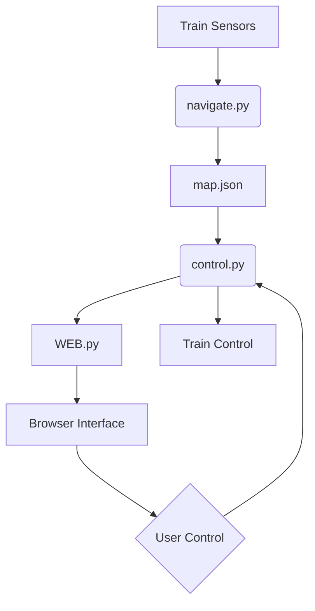

# Intelino Autonomous Rail Network 🚂

[](https://github.com/b31556/intelino)
[](https://python.org)
[](https://opensource.org/licenses/MIT)

A distributed control system for Intelino Smart Trains featuring real-time track visualization, autonomous navigation, and collision prevention.

demo and setup help will be on YouTube soon!


*Example track visualization for 2-train system*

## Key Features ✨

- **Multi-train Coordination**: Support for unlimited trains on extensible tracks
- **Dynamic Pathfinding**: Autonomous route calculation with switch-based navigation
- **Real-time Monitoring**: Web-based visualization server (Port 8585)
- **Collision Prevention**: Zone reservation system with deadlock avoidance
- **Self-discovery**: Automatic track mapping via train sensors

## System Architecture 🏗



## Installation ⚙️

### Requirements
- Intelino Smart Train(s) with firmware v2.0+
- Custom track with color markers (see Configuration)
- Python 3.8+ with pip
- Bluetooth 4.0+ adapter

```bash
git clone https://github.com/b31556/intelino.git
cd intelino
python -m venv venv
source venv/bin/activate  # Linux/MacOS
venv\Scripts\activate.bat  # Windows
pip install -r requirements.txt
```

## Configuration 🛤

### Track Design Rules
1. **Closed Network**  
   - Continuous loop with no dead-ends
   - Minimum 4 switches per train
   - No irreversible diverging routes

2. **Color Marking System**  
   ```plaintext
   Switch Format: [Cyan],[Red / Blue],[Unique color]
   Crossing Format: [White],[Cross`s unique color],[White]
   ```
   

3. **Power Management**  
   - Ensure all trains are fully charged
   - Maintain Bluetooth connection stability

## Usage 🚀

### 2. Start Control System
```bash
python real/control.py
```
AND
```bash
python WEB.py
```
- Connect all trains via Bluetooth
- Access web interface at `http://localhost:8585`

### Web Interface Controls
- Real-time train positions
- Track topology visualization
- Emergency stop trigger

## Technical Documentation 📚

### File Structure
```plaintext
intelino/
├── webserver.py        # Flask visualization server
├── track_visualizer.py # NetworkX graph renderer
├── track_draw.py       # Track image processor
├── mapper.py           # Track discovery module
├── main.py             # Main control logic
└── requirements.txt    # Dependency manifest
```

### Key Algorithms
4. **Pathfinding**  
   ```python
   def makedecision(train, colors):
       # Uses recursive danger checking with
       # probabilistic path selection
       return random.choice(safe_paths)
   ```

5. **Collision Prevention**  
   ```python
   danger_zones = {
       zone_id: reserved_train,
       # Implements zone locking with wait queues
   }
   ```

6. **Visualization**  
   - NetworkX graph rendering
   - Real-time edge coloring
   - Matplotlib image streaming

## Troubleshooting ⚠️

| Symptom               | Solution                          |
|-----------------------|-----------------------------------|
| Connection drops      | Recharge batteries, restart trains |
| Mapping failures      | Verify track continuity           |
| Visualization issues  | Clear browser cache, restart server |
| Deadlocks             | Manually reposition trains        |

## Contributing 🤝

7. Fork repository
8. Create feature branch (`git checkout -b feature/amazing-feature`)
9. Commit changes (`git commit -m 'Add amazing feature'`)
10. Push branch (`git push origin feature/amazing-feature`)
11. Open Pull Request

---

**Disclaimer**: This system may requires constant supervision. Always maintain physical emergency stop capability.
